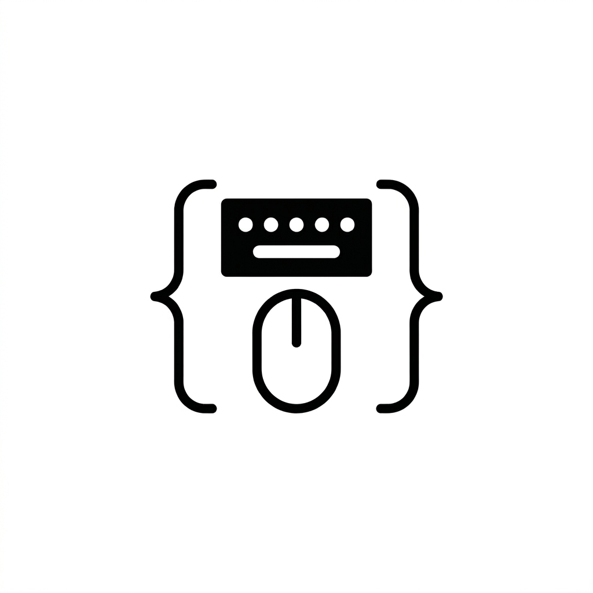

<p align="center">
  
</p>

# Context Daemon (`contextd`)


[](LICENSE.md)


A generic, lightweight Linux daemon that exposes process context (e.g., gaming activity) and hardware inventory via a Varlink interface.

## Purpose

`contextd` allows userspace applications to:
1. **Detect active sessions**: Seamlessly identify when a high-performance app or game starts or stops across multiple launchers.
2. **Hardware Inventory**: List connected peripherals (keyboards, mice, controllers) and check their access permissions (`uaccess`).
3. **IPC Bridge**: Provides a root-level daemon that exposes a safe, unprivileged socket for user-level apps (like RGB controllers or profile switchers) to query system state.

## Features

- **Wide Support**: Detects games and apps from:
  - **Steam**: Native and Flatpak versions.
  - **Heroic Games Launcher**: Epic Games, GOG, and Amazon Games.
  - **Lutris**: Open-source gaming platform for Linux.
- **Hardware-Aware**: 
  - Groups complex udev nodes into single logical devices.
  - **Main Inventory**: Clean list of only active gaming gear (Mice, Keyboards, Controllers, Audio).
  - **RGB Inventory**: Dedicated endpoint for system aesthetics (LEDs, Fans, Lighting Strips).
  - Reports `uaccess` status for "readiness" checks (permission verification).
- **System Diagnostics**:
  - Provides hardware sanity checks for support reporting.
  - Reports RAM/CPU specs, GPU details, and kernel/OS info.
  - Verifies presence of Vulkan and OpenGL libraries.
- **Modern IPC**: Uses [Varlink](https://varlink.org/) for typed, discoverable, and language-agnostic communication.
- **systemd Native**: Distributed as a **systemd portable service**, ensuring zero-dependency deployment on any modern Linux distro.

## Installation (systemd portablectl)

`contextd` is distributed as a **systemd portable service**, ensuring a hardened, isolated environment that still has visibility into hardware and game libraries.

### Arch Linux (Recommended)
Build and install via the native package:
```bash
cd packaging/arch
makepkg -sic
```
This installs the portable image to `/opt/contextd` and automatically attaches it using the `trusted` profile.

### Universal Deployment
For other distributions, use the production deployment script:
```bash
./scripts/deploy.sh
```
This script automates the assembly of the portable OS tree in `/opt/contextd` and manages the `portablectl` lifecycle.

### Interaction
Use the `contextctl` helper to query the daemon:

```bash
# Get active game/app
./scripts/contextctl.sh active

# List installed games
./scripts/contextctl.sh list-games

# List connected gaming peripherals
./scripts/contextctl.sh list-devices

# List RGB controllers, fans, and lights
./scripts/contextctl.sh list-rgb

# Get system diagnostics (RAM, GPU, Vulkan, etc.)
./scripts/contextctl.sh diagnostics
```

## CLI Debugging

You can query the daemon state using the provided wrapper script:

```bash
# Show currently running game
./scripts/contextctl.sh active

# List gaming hardware
./scripts/contextctl.sh list-devices

# List RGB controllers/fans
./scripts/contextctl.sh list-rgb

# Show system diagnostics
./scripts/contextctl.sh diagnostics
```

## Managing the Service

```bash
sudo systemctl status contextd
sudo systemctl restart contextd
```

To detach/uninstall:
```bash
sudo portablectl detach contextd
```

## Configuration

`contextd` can be configured via a TOML file located at `/etc/contextd/config.toml`. A sample configuration is provided in `examples/config.sample.toml`.

### Key Settings:
- **TTLs**: Control how frequently the daemon polls for games, hardware, and diagnostics.
- **Blacklisting**: Ignore specific processes or hardware devices.
- **Security**: Authorize specific systemd units for restricted operations.

## Security & Access Control

The daemon implements a "dumb" but secure peer validation system:
- **Unprivileged Public Sockets**: Basic context (active game, hardware list, controller registration) is accessible via `/run/contextd/public/contextd.socket` to all users.
- **Restricted Private Sockets**: Operational control (RGB lighting) is restricted via `/run/contextd/private/contextd-rgb-control.socket`.
- **Peer Validation**: Uses `SO_PEERCRED` to identify the systemd unit of the calling process for restricted operations.
- **Granular Authorization**: Restricted methods (like updating system lighting) are only allowed if the caller's systemd unit is listed in the `authorized_units` whitelist in `config.toml`.

## Development

- **Repository**: [https://github.com/shanefagan/contextd](https://github.com/shanefagan/contextd)
- **Author**: Shane Fagan

## License

MIT
