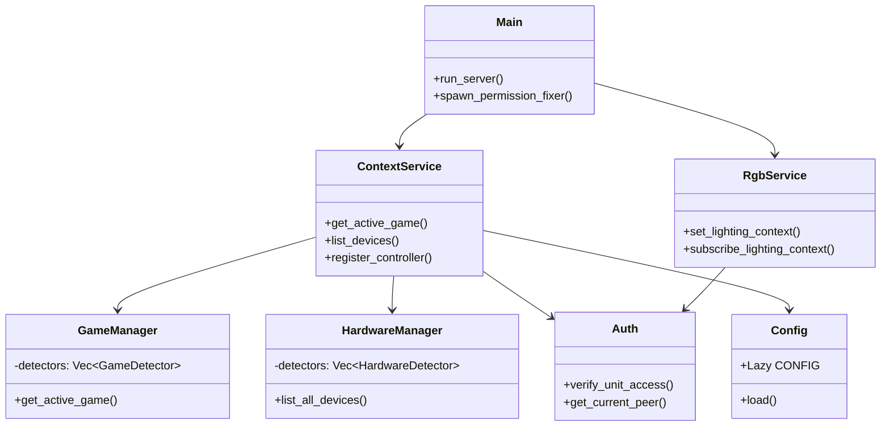
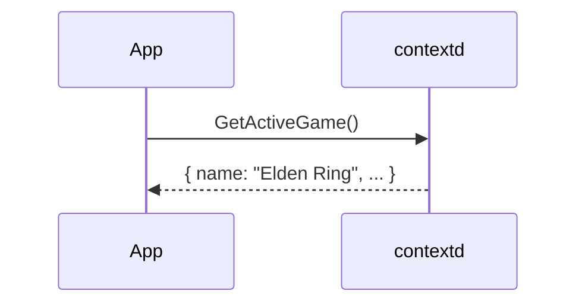
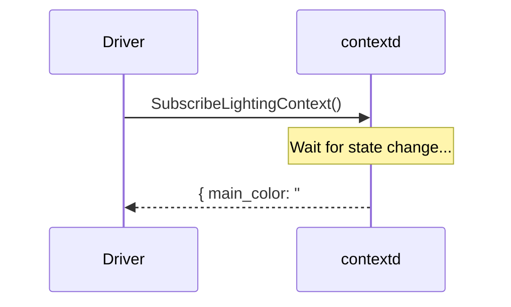
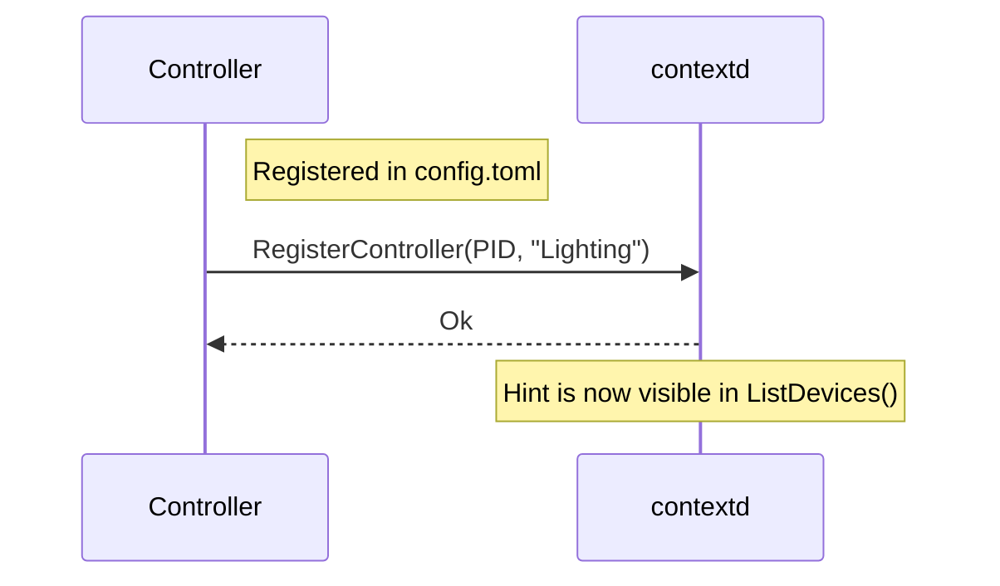

# System Architecture

This document explains the internal design of `contextd` and how external applications interact with the system.

## 🏗️ High-Level Structure

`contextd` follows a "dumb daemon, smart client" philosophy. It acts as a central hub that collects system state and exposes it via a typed interface.

### Key Components:
1.  **Detectors**: Pluggable modules that gather data from various sources:
    *   **Game Detectors**: Poll Steam, Lutris, and Heroic manifests.
    *   **Hardware Detector**: Uses `udev` to discover gaming peripherals and verify `uaccess`.
    *   **Diagnostics**: Gathers system specs (CPU, GPU, RAM) and library support.
2.  **Managers**: Handle caching, TTLs, and data aggregation for each category.
3.  **Varlink Service**: The primary communication layer, exposing typed JSON-RPC over Unix sockets.
4.  **Security Layer**: Enforces access control based on the caller's identity (see `security.md`).

---

## 🛰️ Application Interaction Patterns

### 1. Polling (Status Queries)
Apps like system monitors or dashboard overlays poll the public interface to get the current state.

### 2. Subscription (Reactive Events)
Drivers or background services subscribe to updates to react in real-time (e.g. ambient lighting).

### 3. Hinting (Cooperative Management)
Control apps signal their activity to avoid hardware conflicts via `RegisterController`.

