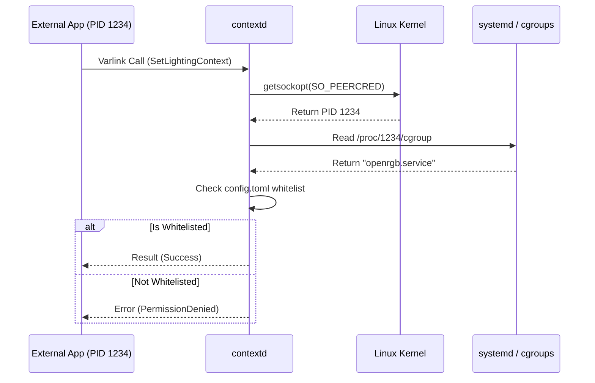

# Security Analysis & Access Control

`contextd` is designed to run as a hardened system service while providing a safe interface for unprivileged user applications.

## 🔒 Peer Validation Mechanism

To protect sensitive operations (like hardware lighting control), `contextd` uses a kernel-level peer validation mechanism based on `SO_PEERCRED`.

### Access Levels:
1.  **Unprivileged Public Sockets**: Basic context (active game, hardware list) is accessible via `/run/contextd/public/*.socket` (Mode 0666).
2.  **Restricted Private Sockets**: Control operations (RGB lighting, controller registration) are restricted via `/run/contextd/private/*.socket`.
3.  **Granular Authorization**: Restricted methods are only allowed if the caller's systemd unit is listed in the `authorized_units` whitelist in `config.toml`.

---

## 🛠️ Service Hardening

The daemon runs as a `DynamicUser` within a **systemd portable service**. It uses systemd capabilities to elevate privileges only where strictly necessary:

*   **CAP_SYS_PTRACE**: Required for reading `/proc/*/environ` to detect active games.
*   **CAP_DAC_READ_SEARCH**: Required for accessing game manifests in user `/home` directories.

### Isolation Features:
- `ProtectSystem=strict`: The root filesystem is read-only.
- `ProtectHome=read-only`: Access to `/home` is restricted to read-only via `BindReadOnlyPaths`.
- `NoNewPrivileges=yes`: Prevents the process from gaining new privileges via execve.
- **Bounded Channels**: The RGB observer socket uses bounded channels with non-blocking sends to prevent memory exhaustion by slow clients.
